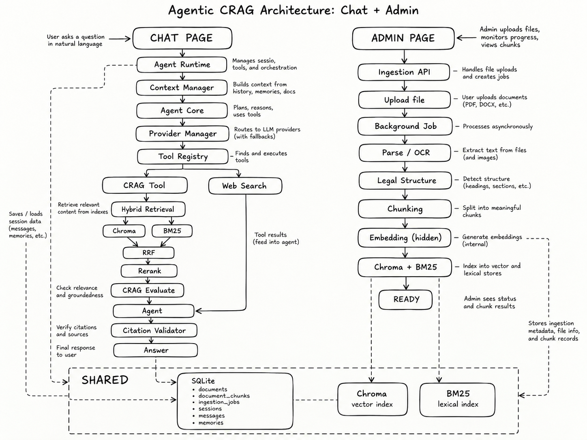
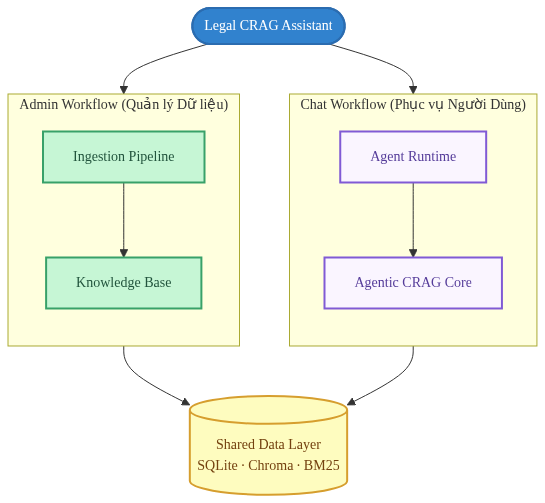

# Sơ đồ và Luồng Hoạt động Toàn diện — Legal CRAG Assistant

> **Tài liệu đặc tả kiến trúc, luồng hoạt động (Workflow) và cấu trúc kho tri thức (Knowledge Base) của Legal CRAG Assistant**, hợp nhất toàn diện hai luồng nghiệp vụ chính:
>
> * **Chat Workflow:** Agent Core vận hành theo vòng lặp ReAct, tự quyết định khi nào cần sử dụng CRAG nội bộ hoặc mở rộng Web Search có kiểm soát.
> * **Admin Workflow & Knowledge Base:** Tiếp nhận tài liệu pháp lý, xử lý đa luồng, làm sạch chuyên sâu, phân mảnh theo ngữ nghĩa điều luật (Legal-aware Chunking) và lập chỉ mục kép (Chroma & BM25) phục vụ truy hồi chính xác.

## MỤC LỤC

1. [Tổng quan kiến trúc](#1-tổng-quan-kiến-trúc)
2. [Kiến trúc dữ liệu dùng chung (Shared Data Layer)](#2-kiến-trúc-dữ-liệu-dùng-chung-shared-data-layer)
3. [Đặc tả Data Model (SQLite app.db)](#3-đặc-tả-data-model-sqlite-appdb)
4. [Chat Workflow — Agentic CRAG](#4-chat-workflow--agentic-crag)
5. [Session, History và Memory](#5-session-history-và-memory)
6. [Admin Workflow — Ingestion Pipeline](#6-admin-workflow--ingestion-pipeline)
7. [Cơ chế Phân đoạn Pháp lý (Legal-aware Chunking)](#7-cơ-chế-phân-đoạn-pháp-lý-legal-aware-chunking)
8. [Embedding, Vector Index và Hybrid Retrieval](#8-embedding-vector-index-và-hybrid-retrieval)
9. [Cơ chế Rebuild, Thay đổi Model và Khắc phục Lỗi](#9-cơ-chế-rebuild-thay-đổi-model-và-khắc-phục-lỗi)
10. [Nguyên tắc Hiển thị Admin và Phân tách Vai trò](#10-nguyên-tắc-hiển-thị-admin-và-phân-tách-vai-trò)
11. [Workflow tổng thể](#11-workflow-tổng-thể)
12. [Các nguyên tắc kiến trúc bắt buộc](#12-các-nguyên-tắc-kiến-trúc-bắt-buộc)

# 1. Tổng quan kiến trúc

Hệ thống Legal CRAG Assistant được tổ chức thành hai luồng nghiệp vụ độc lập nhưng chia sẻ chung tầng dữ liệu nền tảng:

Hai luồng nghiệp vụ đảm nhận các vai trò chuyên biệt và có ranh giới trách nhiệm rõ ràng:

### Chat Workflow (Phục vụ Người dùng)
Chịu trách nhiệm tương tác và phản hồi câu hỏi pháp lý của người dùng cuối:
* Tiếp nhận câu hỏi từ giao diện Chat Page kèm định danh khách hàng (`client_id`, `session_id`).
* **Agent Runtime** khởi tạo lượt hội thoại, phối hợp với **Context Manager** để nạp lịch sử hội thoại ngắn hạn và hồ sơ doanh nghiệp dài hạn.
* **Agent Core** vận hành vòng lặp ReAct (Reasoning → Acting → Observing), sử dụng mô hình LLM tự chủ quyết định việc tra cứu.
* **Citation Validator** kiểm định trích dẫn và hiệu lực văn bản trước khi đưa ra câu trả lời cuối cùng.

Agent Core không sử dụng Router cứng để phân loại câu hỏi trước. Thay vào đó, mô hình ngôn ngữ tự quyết định:
* **Trả lời trực tiếp** (với các câu chào hỏi, xã giao hoặc ngữ cảnh đã có sẵn);
* **Gọi `crag_search`** (tra cứu tri thức pháp luật nội bộ đã lập chỉ mục);
* **Gọi `controlled_web_search`** (tìm kiếm trên cổng thông tin pháp luật chính thống);
dựa trên context, system prompt và tool schema.

### Admin Workflow (Quản lý Tri thức)
Chịu trách nhiệm cho toàn bộ vòng đời dữ liệu pháp lý từ lúc tiếp nhận văn bản thô đến khi sẵn sàng phục vụ truy hồi:
* Tiếp nhận tài liệu tải lên (PDF, DOCX, TXT) qua Admin Page hoặc Upload API.
* Kích hoạt tiến trình xử lý nền (**Background Worker**) chạy bất đồng bộ để tránh nghẽn giao diện.
* Chuỗi xử lý tự động hóa gồm 8 giai đoạn: Parse định dạng → Vision LLM OCR cho trang scan → Làm sạch nhiễu Regex → Cấu trúc hóa điều luật → Phân đoạn ngữ nghĩa (Legal-aware Chunking) → Tạo vector nhúng BGE-M3 → Lập chỉ mục kép Chroma & BM25 → Cập nhật trạng thái `READY`.

Admin chỉ cần:
* Upload tài liệu (PDF, DOCX, TXT);
* Theo dõi tiến trình xử lý chi tiết theo thời gian thực;
* Xem trạng thái tài liệu và duyệt các đoạn văn bản (chunk) sau khi trích xuất.
Toàn bộ các bước kỹ thuật chuyên sâu như tạo vector embedding hay lập chỉ mục tìm kiếm đều diễn ra hoàn toàn tự động dưới nền.

### Phân định Ranh giới Trách nhiệm
* **Knowledge Base chịu trách nhiệm:** Quản lý vòng đời dữ liệu, trích xuất văn bản, OCR, làm sạch, phân đoạn điều luật, lưu trữ SQLite, sinh vector Chroma, xây dựng chỉ mục BM25 và cung cấp các ứng viên cho Hybrid Retrieval.
* **Knowledge Base không chịu trách nhiệm:** Suy luận tác tử (Agent reasoning), quản lý lịch sử hội thoại (Conversation history), bộ nhớ người dùng (User memory), sinh câu trả lời cuối cùng và kiểm định trích dẫn. Các thành phần này thuộc trách nhiệm độc quyền của Chat / Agent Runtime.

# 2. Kiến trúc dữ liệu dùng chung (Shared Data Layer)

Hệ thống sử dụng ba thành phần lưu trữ chính, phối hợp chặt chẽ theo mô hình tam giác dữ liệu:

### Tam giác Lưu trữ Cốt lõi
* **SQLite (`app.db`) = Source of Truth (Nguồn chân lý duy nhất):** Nơi lưu trữ toàn bộ dữ liệu chuẩn đã làm sạch, cấu trúc điều luật, metadata văn bản và trạng thái phiên làm việc.
* **ChromaDB = Dense Vector Index (Chỉ mục Vector Ngữ nghĩa):** Lưu trữ các vector đặc trưng 1024 chiều phục vụ tìm kiếm ngữ nghĩa tương đồng.
* **BM25 = Lexical Index (Chỉ mục Từ khóa Chính xác):** Lưu trữ chỉ mục tần suất từ phục vụ tìm kiếm từ khóa và số hiệu pháp lý chính xác.

Điều này đảm bảo nguyên tắc:
* Nội dung chunk chuẩn luôn tồn tại nguyên bản trong SQLite.
* Vector embedding trong Chroma và chỉ mục từ khóa trong BM25 luôn có thể được tái tạo (rebuild) hoàn chỉnh bất kỳ lúc nào từ SQLite mà không cần nạp hay parse lại file gốc.
* Thống nhất định danh: `Chroma.id == document_chunks.id == BM25 document reference` nhằm giúp việc đối chiếu, truy vết và debug dữ liệu diễn ra trực tiếp, không cần tầng mapping trung gian.

# 3. Đặc tả Data Model (SQLite app.db)

Cơ sở dữ liệu SQLite `app.db` được chuẩn hóa theo 8 bảng quan hệ chia thành hai phân hệ nghiệp vụ độc lập:

## 3.1. Phân hệ Knowledge Base

### Bảng `documents`
Quản lý danh mục tài liệu pháp lý tải lên hệ thống:
* `id`: Khóa chính định danh văn bản (ví dụ: `doc_219_2025`).
* `filename`: Tên tệp gốc được tải lên.
* `title`: Tiêu đề hoặc trích yếu nội dung văn bản.
* `document_number`: Số hiệu văn bản quy phạm (ví dụ: `219/2025/NĐ-CP`).
* `document_type`: Loại văn bản (Luật, Nghị định, Thông tư, Quyết định).
* `issuing_authority`: Cơ quan ban hành (Quốc hội, Chính phủ, Bộ ngành).
* `effective_from`: Ngày bắt đầu có hiệu lực pháp luật.
* `effective_to`: Ngày hết hiệu lực (nếu có).
* `status`: Trạng thái xử lý ingestion (`UPLOADED`, `PROCESSING`, `READY`, `FAILED`).
* `content_hash`: Mã băm SHA-256 của tệp để chống nạp trùng lặp.
* `error_message`: Thông điệp lỗi chi tiết khi trạng thái là `FAILED`.
* `created_at`, `updated_at`: Dấu thời gian hệ thống.

### Bảng `document_chunks`
Lưu trữ các đoạn phân mảnh pháp lý chuẩn mực — đơn vị cơ sở cho việc lập chỉ mục và truy hồi:
* `id`: Khóa chính định danh chunk (ví dụ: `doc_219_2025_c0012`).
* `document_id`: Khóa ngoại liên kết tới bảng `documents`.
* `chunk_index`: Thứ tự tuần tự của chunk trong văn bản gốc.
* `chapter`: Tiêu đề hoặc số thứ tự Chương / Phần.
* `section`: Mục / Tiểu mục (nếu có).
* `article`: Tên Điều (ví dụ: `Điều 7`).
* `clause`: Tên Khoản (ví dụ: `Khoản 2`).
* `point`: Tên Điểm (ví dụ: `Điểm a`).
* `heading`: Tiêu đề phân đoạn hoàn chỉnh phục vụ ngữ cảnh tìm kiếm.
* `content`: Nội dung văn bản pháp lý đã được làm sạch và chuẩn hóa.
* `page_start`, `page_end`: Số trang bắt đầu và kết thúc trong tệp PDF gốc.
* `token_count`: Số lượng từ/token ước tính của chunk.

### Bảng `ingestion_jobs`
Theo dõi chi tiết tiến trình nạp dữ liệu cho Admin:
* `id`: Khóa chính của tác vụ xử lý (ví dụ: `job_a1b2c3d4e5f6`).
* `document_id`: Khóa ngoại liên kết tới `documents`.
* `stage`: Giai đoạn hiện tại (`PARSING`, `OCR`, `CLEANING`, `STRUCTURING`, `CHUNKING`, `EMBEDDING`, `INDEXING`, `DONE`, `FAILED`).
* `progress`: Phần trăm hoàn thành tương đối của toàn bộ tiến trình (0.0 - 100.0).
* `detail`: Mô tả tiến độ chi tiết theo bước con (ví dụ: *"OCR trang 12/45"*, *"Đang nhúng đoạn 320/1200"*).
* `processed_units`, `total_units`: Bộ đếm số lượng trang hoặc chunk thực tế.
* `started_at`, `finished_at`: Mốc thời gian thực thi.

### Bảng `legal_relations`
Lưu trữ lịch sử và quan hệ hiệu lực văn bản:
* `source_document_id`: Văn bản ban hành sau.
* `target_document_id`: Văn bản chịu tác động.
* `relation_type`: Loại quan hệ (`amends` - sửa đổi, `replaces` - thay thế, `repeals` - bãi bỏ, `supplements` - bổ sung).

## 3.2. Phân hệ Conversation State

* `clients`: Định danh khách hàng hoặc doanh nghiệp (`id`, `name`, `created_at`).
* `sessions`: Quản lý phiên làm việc (`id`, `client_id`, `started_at`, `last_active_at`).
* `messages`: Lưu trữ nguyên văn lịch sử hỏi đáp (`id`, `session_id`, `role`, `content`, `route`, `crag_action`, `created_at`).
* `memories`: Hồ sơ thông tin doanh nghiệp dài hạn (`id`, `client_id`, `key`, `value`, `confidence`, `source_text`, `updated_at`).

# 4. Chat Workflow — Agentic CRAG

## 4.1. Agent Runtime

Module `agent/runtime.py` đóng vai trò là điểm điều phối duy nhất (Single Entry Point) cho toàn bộ chu trình hội thoại của Agent, đảm bảo tính nhất quán trên API chat, giao diện dòng lệnh CLI và kịch bản Benchmark:
1. `prepare_turn`: Tiếp nhận câu hỏi, giải quyết định danh phiên, trích xuất memory mới và tập hợp ngữ cảnh qua Context Manager.
2. Thực thi đồ thị Agent Core: Vận hành vòng lặp ReAct gọi công cụ và suy luận.
3. `validate_citations`: Kiểm tra tính xác thực của các căn cứ pháp lý được trích dẫn.
4. `persist_turn`: Lưu trữ cả câu hỏi của người dùng và câu trả lời hoàn chỉnh vào bảng `messages` trong SQLite.
5. Trả về phản hồi cho người dùng qua giao diện streaming SSE hoặc phản hồi JSON trực tiếp.

## 4.2. Context Manager

Module `agent/context.py` chịu trách nhiệm chuẩn bị ngữ cảnh hội thoại toàn diện trước khi chuyển tiếp cho Agent Core:
* **Current Question:** Câu hỏi hiện tại của người dùng kèm ngày tham chiếu hiệu lực `as_of_date`.
* **Recent Conversation History:** Lịch sử trao đổi trong `HISTORY_TURNS` lượt gần nhất từ bảng `messages`, giúp mô hình hiểu rõ các câu hỏi nối tiếp và đại từ thay thế.
* **Long-term Memory:** Hồ sơ doanh nghiệp trích xuất từ bảng `memories` (loại hình doanh nghiệp, tỉnh thành, ngành nghề).
* **Session Information:** Định danh người dùng `client_id` và phiên hội thoại `session_id`.

Context Manager không thực hiện truy hồi tài liệu pháp luật. Nhiệm vụ của nó là cung cấp bức tranh ngữ cảnh đầy đủ để LLM quyết định hành vi tiếp theo.

## 4.3. Agent Core — ReAct Loop

Agent Core được xây dựng trên nền tảng LangGraph theo mô hình ReAct (Reasoning + Acting) tự chủ:
* **Agent Node:** LLM tiếp nhận ngữ cảnh, phân tích câu hỏi và suy nghĩ (*Reason*). Nếu cần dữ liệu hỗ trợ, mô hình sẽ phát lệnh gọi công cụ (*Act*).
* **Tool Node:** Đón nhận yêu cầu gọi công cụ từ Agent Node, chuyển tiếp đến Tool Registry để thực thi và thu thập bằng chứng (*Observe*).
* **Vòng lặp:** Kết quả trả về từ công cụ được gắn ngược lại vào lịch sử ReAct để Agent Node tiếp tục suy luận. Quá trình lặp lại cho đến khi mô hình đánh giá đã đủ thông tin để trả lời hoặc chạm ngưỡng giới hạn an toàn.
* Khi mô hình quyết định đưa ra câu trả lời cuối cùng, luồng xử lý sẽ chuyển tiếp sang **Citation Validator** trước khi kết thúc.

## 4.4. Tool Registry

Hệ thống cung cấp đúng hai công cụ nghiệp vụ đại diện cho hai nguồn tri thức:
* **`crag_search`:** Tra cứu tri thức pháp lý trong kho nội bộ đã được nạp và lập chỉ mục.
* **`controlled_web_search`:** Tìm kiếm bổ sung trên các cổng thông tin pháp luật chính thống của nhà nước khi kho nội bộ không đủ thông tin.

Các thao tác kỹ thuật như tra cứu cơ sở dữ liệu SQLite, tìm kiếm vector trong Chroma hay tính điểm BM25 được đóng gói hoàn toàn bên trong `crag_search`, không phơi bày ra bên ngoài để tránh làm phức tạp không gian quyết định của LLM.

## 4.5. Quy trình Chi tiết của `crag_search`

Công cụ `crag_search` (`tools/crag_search.py`) triển khai trọn vẹn kiến trúc Corrective RAG:

### Hybrid Retrieval
Thực hiện tìm kiếm đồng thời trên kho dữ liệu với câu truy vấn pháp lý:
* **Chroma Dense Search:** Thu thập Top-20 đoạn văn bản tương đồng nhất về ngữ nghĩa.
* **BM25 Lexical Search:** Thu thập Top-20 đoạn văn bản khớp chính xác từ khóa và locator.

### RRF Fusion
Áp dụng giải thuật **Reciprocal Rank Fusion** với hằng số làm mịn k = 60:
$$S_{\text{RRF}}(d) = \sum_{r \in \{\text{Dense}, \text{BM25}\}} \frac{1}{60 + \text{rank}_r(d)}$$
Công thức này khử độ lệch thang điểm giữa Cosine Similarity và BM25 log-odds, tạo ra danh sách 20 ứng viên hàng đầu được sắp xếp công bằng và ổn định.

### Reranking & Sigmoid Normalization
Danh sách ứng viên từ RRF được đưa qua mô hình Cross-Encoder chuyên biệt `BAAI/bge-reranker-v2-m3`. Điểm logit thô được chuẩn hóa qua hàm Sigmoid về dải xác suất [0.0, 1.0], sau đó lọc ra Top-5 tài liệu liên quan nhất.

## 4.6. Cơ chế Đánh giá CRAG (CRAG Evaluation)

Bộ đánh giá Retrieval Evaluator căn cứ vào điểm số cao nhất trong danh sách Top-5 để phân định 3 nhánh xử lý:
* **CORRECT (best_score >= 0.70):** Kho nội bộ chứa đầy đủ bằng chứng tin cậy. Hệ thống kích hoạt module Knowledge Refinement để bóc tách các legal strips chi tiết và thông báo Agent có thể trả lời trực tiếp mà không cần tra cứu thêm.
* **AMBIGUOUS (0.35 < best_score < 0.70):** Bằng chứng nội bộ chỉ liên quan một phần hoặc còn thiếu thông tin cụ thể. Hệ thống gửi bằng chứng kèm chỉ dẫn (*guidance*) khuyến nghị Agent cân nhắc gọi thêm `controlled_web_search`.
* **INCORRECT (best_score <= 0.35):** Kho tri thức nội bộ không có văn bản phù hợp hoặc câu hỏi nằm ngoài phạm vi. Hệ thống phát tín hiệu yêu cầu Agent bắt buộc phải tìm kiếm ngoài qua Web Search, hoặc thừa nhận chưa đủ căn cứ nếu tìm kiếm ngoài cũng không có kết quả.

### Cấu trúc dữ liệu trả về từ `crag_search`
Tool trả về cấu trúc chuẩn hóa cho Agent:
* `evidence`: Danh sách các mảnh bằng chứng pháp lý đã bóc tách (`strip_id`, `heading`, `text`, `score`).
* `crag_action`: Kết quả đánh giá (`CORRECT`, `AMBIGUOUS`, `INCORRECT`).
* `guidance`: Hướng dẫn hành động bằng ngôn ngữ tự nhiên để định hướng suy luận cho LLM.

## 4.7. Tìm kiếm Web có Kiểm soát (`controlled_web_search`)

Công cụ `controlled_web_search` (`tools/web_search.py`) được kích hoạt khi kho nội bộ không đáp ứng đủ:
* Agent tự động biên soạn câu truy vấn tìm kiếm ngắn gọn, trọng tâm dựa trên lỗ hổng thông tin cần bù đắp.
* Thực hiện tìm kiếm thông qua TinyFish Search API, giới hạn phạm vi chỉ trong các cổng thông tin pháp luật chính thống của nhà nước (`vbpl.vn`, `chinhphu.vn`, `moj.gov.vn`, `congbao.chinhphu.vn`,...).
* Tải nội dung trang web, loại bỏ thành phần giao diện thừa (HTML chrome, navigation, scripts) và tinh chế thành các đoạn trích dẫn (external legal strips) có gắn URL nguồn gốc minh bạch.

## 4.8. Các Kịch bản Suy luận Thực tế của Agent

* **Kịch bản 1: Câu hỏi phức tạp cần kết hợp đa nguồn**
  Agent gọi `crag_search` → Nhận kết quả `AMBIGUOUS` → Agent phân tích phần thông tin còn thiếu và gọi `controlled_web_search` → Nhận external evidence → Agent tổng hợp cả hai nguồn tri thức để đưa ra câu trả lời toàn diện có trích dẫn.
* **Kịch bản 2: Kho nội bộ đã có đầy đủ văn bản**
  Agent gọi `crag_search` → Nhận kết quả `CORRECT` → Agent trả lời trực tiếp dựa trên các căn cứ nội bộ đã được bóc tách mà không kích hoạt Web Search.
* **Kịch bản 3: Câu hỏi chào hỏi hoặc giao tiếp xã giao**
  Agent phát hiện câu hỏi không mang tính nghiệp vụ pháp lý → Trả lời lịch sự trực tiếp ngay tại lượt suy luận đầu tiên mà không gọi bất kỳ công cụ nào.

## 4.9. Giới hạn Vòng lặp Công cụ (Safety Guardrail)

Để ngăn ngừa tình trạng mô hình rơi vào vòng lặp gọi tool vô hạn, hệ thống áp đặt ngưỡng trần an toàn `MAX_TOOL_ROUNDS = 3`. Nếu vượt quá 3 lượt gọi công cụ trong một turn, hệ thống sẽ ngắt quyền gọi tool và yêu cầu Agent tổng hợp câu trả lời dựa trên những bằng chứng đã tích lũy được, hoặc trả lời thừa nhận chưa đủ cơ sở nếu không tìm thấy chứng cứ.

## 4.10. Tổng hợp Câu trả lời và Kiểm định Trích dẫn

Khi Agent quyết định dừng gọi công cụ, phản hồi được đưa qua **Citation Validator** (`legal/citations.py`):
* Kiểm tra toàn bộ mã nguồn trích dẫn `[source_id]` trong câu trả lời có thực sự tồn tại trong danh sách bằng chứng đã thu thập hay không (loại bỏ ảo giác trích dẫn).
* Kiểm tra tình trạng hiệu lực của văn bản quy phạm pháp luật được trích dẫn tại ngày tham chiếu `as_of_date`.
* Nếu câu trả lời hợp lệ, hệ thống xuất phản hồi kèm báo cáo độ tin cậy trích dẫn (Citation Report). Nếu không đủ bằng chứng, hệ thống thiết lập cờ `abstain = true` để trả lời an toàn: *"Chưa đủ căn cứ pháp lý để kết luận."*

# 5. Session, History và Memory

Hệ thống phân định rạch ròi ba khái niệm lưu trữ nhằm đảm bảo tính toàn vẹn và bảo mật dữ liệu:

* **Session (Phiên kết nối):** Quản lý phiên làm việc của người dùng trong bảng `sessions`, gắn liền với `client_id` và cập nhật mốc thời gian hoạt động `last_active_at`.
* **History (Lịch sử ngắn hạn):** Lưu trữ toàn bộ câu hỏi và câu trả lời trong bảng `messages`. Context Manager chỉ lấy `HISTORY_TURNS` cặp hội thoại gần nhất để hỗ trợ giải quyết các câu hỏi phụ thuộc ngữ cảnh trước.
* **Memory (Hồ sơ dài hạn):** Lưu trữ các thông tin hồ sơ doanh nghiệp bền vững trong bảng `memories` (loại hình, địa bàn hoạt động, ngành nghề). Danh mục thông tin được kiểm soát nghiêm ngặt theo `ALLOWED_MEMORY_KEYS`.
* **Nguyên tắc an toàn:** Memory chỉ được sử dụng để hiểu ngữ cảnh của người hỏi (ví dụ: xác định "công ty tôi" ở tỉnh nào), **tuyệt đối không được sử dụng Memory làm căn cứ pháp lý**. Căn cứ pháp lý bắt buộc phải đến từ tài liệu được trích dẫn.

## 5.1. Cơ chế Lưu trữ Không Phụ thuộc Checkpointer

LangGraph chỉ quản lý trạng thái luân chuyển trong phạm vi **một lượt hỏi duy nhất**. Trạng thái giữa các lượt hội thoại được duy trì độc lập thông qua SQLite và Context Manager. Thiết kế này giúp hệ thống hoạt động ổn định, nhẹ nhàng, không bị phình to bộ nhớ và dễ dàng bảo trì hoặc sao lưu dữ liệu.

## 5.2. Quản lý Nhà cung cấp Mô hình (Provider Manager)

Module `llm.py` triển khai Factory Pattern linh hoạt hỗ trợ đa nhà cung cấp:
* **Groq:** Tối ưu hóa tốc độ phản hồi với mô hình suy luận `qwen/qwen3.8-27b`.
* **OpenAI:** Hỗ trợ `gpt-4o` và `gpt-4o-mini`.
* **OpenRouter:** Hỗ trợ đa dạng mô hình nguồn mở như `deepseek/deepseek-chat`, `claude-3.5-sonnet`.
* **Ollama:** Phục vụ triển khai on-premise nội bộ hoàn toàn offline với `qwen3.8:latest`.
* Hệ thống tự động chuyển đổi sang danh sách `LLM_FALLBACK_PROVIDERS` nếu nhà cung cấp chính gặp sự cố khởi tạo hoặc thiếu khóa truy cập API.

# 6. Admin Workflow — Ingestion Pipeline

Quy trình nạp tài liệu chuyển hóa văn bản thô thành kho tri thức có cấu trúc sẵn sàng cho CRAG truy vấn:

## 6.1. Tiếp nhận Tài liệu (Upload API)
Hỗ trợ nạp đơn lẻ (`POST /api/admin/documents/upload`) hoặc nạp cả thư mục nhiều tệp (`POST /api/admin/documents/upload-batch`). Ngay khi nhận tệp, hệ thống khởi tạo bản ghi trong `documents` và tạo tác vụ trong `ingestion_jobs` với trạng thái `PARSING`, phản hồi mã tiến trình ngay lập tức để người dùng không phải chờ đợi.

## 6.2. Xử lý Song song Ngầm (Background Worker)
Module `ingestion/worker.py` sử dụng thread pool với `INGESTION_WORKERS = 3` để xử lý song song nhiều tài liệu độc lập. Khi nạp hàng loạt, chỉ mục BM25 không bị tính toán lại sau từng tệp mà được gom lại để tái tạo một lần duy nhất sau khi toàn bộ đợt nạp hoàn tất, tiết kiệm tài nguyên xử lý.

## 6.3. Trích xuất Nội dung (Parsing)
Parser tự động nhận diện và xử lý linh hoạt từng định dạng:
* Với tệp Word (`.docx`, `.doc`): Trích xuất trực tiếp cấu trúc văn bản.
* Với tệp PDF: Kiểm tra từng trang để phân loại trang có sẵn lớp text số hóa hay trang quét ảnh scan. Nếu trang có text số hóa, hệ thống trích xuất trực tiếp qua PyMuPDF. Nếu là trang scan, hệ thống chuyển tiếp sang bước Vision OCR.

## 6.4. Nhận dạng Chữ Quang học (Vision LLM OCR)
Các trang PDF scan được kết xuất thành ảnh và chuyển tới mô hình Vision LLM xử lý đồng thời với cơ chế `OCR_CONCURRENCY = 4`. Kết quả OCR được lưu bộ nhớ đệm tại `data/processed/ocr_cache/` nhằm tái sử dụng nếu tài liệu được nạp lại.

## 6.5. Làm sạch Văn bản (Cleaning)
Module `legal/cleaner.py` áp dụng các bộ lọc chuyên biệt cho văn bản pháp quy Việt Nam:
* Loại bỏ chuỗi dấu chấm điền biểu mẫu (dot leaders), mục lục, số trang chạy chân trang và khối chữ ký, nơi nhận.
* Chuẩn hóa bảng mã Unicode tiếng Việt (NFC) và loại bỏ các ký tự vô hình.
* Giữ nguyên vẹn các tiêu đề phân cấp pháp lý quan trọng (*Chương*, *Mục*, *Điều*, *Khoản*, *Điểm*).

## 6.6. Cấu trúc hóa Pháp lý (Structuring)
Module `legal/parser.py` nhận diện cấu trúc phân cấp quy phạm pháp luật Việt Nam theo thứ tự: Phần → Chương → Mục → Điều → Khoản → Điểm. Mỗi phân đoạn đều được gán nhãn locator định danh duy nhất và lưu vết số trang nguồn (`page_start`, `page_end`).

# 7. Cơ chế Phân đoạn Pháp lý (Legal-aware Chunking)

Hệ thống tuyệt đối **không cắt đoạn văn bản pháp luật bằng các thuật toán cắt đều theo số ký tự cố định** (như RecursiveCharacterTextSplitter 500 hoặc 1000 ký tự), vì phương pháp đó làm vỡ vụn câu chữ và cắt đứt liên kết ngữ nghĩa giữa các điều khoản.

Thay vào đó, hệ thống áp dụng kỹ thuật **Legal-aware Chunking** với các nguyên tắc nghiêm ngặt:

### Thứ tự Ưu tiên Phân ranh giới
1. **Ưu tiên cấp Điều:** Nếu một Điều có dung lượng vừa phải (dưới 1200 từ), hệ thống giữ trọn vẹn toàn bộ Điều thành một chunk duy nhất để bảo toàn ngữ cảnh hoàn chỉnh.
2. **Phân tách theo cấp Khoản:** Khi một Điều quá dài gồm nhiều nghĩa vụ độc lập, hệ thống chia nhỏ Điều đó theo từng Khoản (Khoản 1, Khoản 2,...).
3. **Phân tách theo cấp Điểm:** Khi một Khoản quá dài liệt kê chi tiết các điều kiện (Điểm a, Điểm b, Điểm c,...), hệ thống tiếp tục bóc tách theo cụm Điểm.
4. **Không tạo chunk xuyên Điều:** Ranh giới của một chunk không bao giờ được phép vượt qua hai Điều luật khác nhau.

### Chuẩn hóa Nội dung Độc lập Ngữ cảnh
Để mỗi chunk khi đứng riêng lẻ vẫn truyền tải đầy đủ ý nghĩa cho mô hình nhúng (Embedding) và người đọc, nội dung text của chunk được cấu trúc hóa theo khuôn dạng:
* Dòng 1: Tiêu đề và số hiệu văn bản gốc (ví dụ: *Văn bản: Nghị định 219/2025/NĐ-CP*).
* Dòng 2: Tên Chương và tên Mục cha.
* Dòng 3: Số Điều và tên Điều (ví dụ: *Điều 7. Điều kiện cấp giấy phép lao động*).
* Dòng 4: Số Khoản hoặc Điểm cụ thể.
* Phần nội dung quy phạm chi tiết.

Kỹ thuật này giúp vector embedding nắm bắt trọn vẹn cả bối cảnh pháp lý của văn bản lẫn nội dung quy định chi tiết, giải quyết triệt để hiện tượng mất ngữ cảnh khi truy hồi.

# 8. Embedding, Vector Index và Hybrid Retrieval

## 8.1. Quy trình Tạo Vector Nhúng (Embedding)
* Các chunk văn bản lưu trong SQLite được gom thành từng batch 64 chunks để tối ưu hóa thông lượng truyền dữ liệu tới bộ xử lý.
* Mô hình nhúng chuẩn: `BAAI/bge-m3` tạo vector đặc trưng 1024 chiều có khả năng thấu hiểu ngữ nghĩa sâu sắc đối với ngôn ngữ pháp lý tiếng Việt.
* Độc lập giữa Chat LLM và Embedding Provider: Việc thay đổi nhà cung cấp mô hình hội thoại (ví dụ từ Groq sang OpenAI) hoàn toàn không ảnh hưởng tới vector index đã được lập chỉ mục bởi BGE-M3.

## 8.2. Tính Nhất quán trong Không gian Vector
* Toàn bộ document chunks trong cùng một Chroma collection bắt buộc phải sử dụng chung một mô hình embedding và cùng số chiều vector.
* Vector nhúng của câu hỏi người dùng (*Query Embedding*) bắt buộc phải được tạo bởi cùng mô hình nhúng đã dùng khi nạp dữ liệu (*Document Embedding*).

## 8.3. Cơ chế Truy hồi Lai (Hybrid Retrieval)
* **Dense Retrieval (ChromaDB):** Đảm nhiệm việc nắm bắt ý định người dùng thông qua độ tương đồng ngữ nghĩa, hiệu quả cao với các câu hỏi diễn đạt tự nhiên hoặc tìm kiếm khái niệm.
* **Lexical Retrieval (BM25Okapi):** Đảm nhiệm việc bắt chính xác từ khóa định danh, số hiệu văn bản, số Điều và Khoản cụ thể.
* **Hợp nhất RRF (Reciprocal Rank Fusion):** Tích hợp hai danh sách kết quả xếp hạng mà không phụ thuộc vào thang điểm thô (Cosine score vs BM25 score), tạo ra danh sách ứng viên có độ phủ toàn diện nhất trước khi chuyển tiếp sang Cross-Encoder Reranker.

# 9. Cơ chế Rebuild, Thay đổi Model và Khắc phục Lỗi

Nhờ kiến trúc coi SQLite là Single Source of Truth, hệ thống sở hữu khả năng bảo trì và khôi phục cực kỳ linh hoạt:

### 9.1. Tái tạo Chỉ mục Vector (Rebuild Chroma)
Nếu chỉ mục Chroma bị hỏng hoặc mất dữ liệu, hệ thống chỉ cần đọc trực tiếp các bản ghi từ bảng `document_chunks` trong SQLite và đưa qua mô hình Embedding để nạp lại vào Chroma. Hoàn toàn không cần phải tải lại tệp PDF gốc hay thực hiện lại các bước Parse, OCR, Clean và Chunking tốn kém.

### 9.2. Tái tạo Chỉ mục Từ khóa (Rebuild BM25)
Chỉ mục BM25 được tái tạo trực tiếp từ text của `document_chunks`. Khi nạp hàng loạt (Batch Ingestion), hệ thống xử lý xong toàn bộ danh sách tệp rồi mới kích hoạt rebuild BM25 một lần duy nhất, tránh tình trạng tính toán lặp lại.

### 9.3. Thay đổi Mô hình Embedding
Khi nâng cấp sang một mô hình Embedding mới:
* Không cần phân tích lại cấu trúc hay cắt đoạn lại văn bản nếu chiến lược chunking không đổi.
* Chỉ cần chạy quy trình: Đọc `document_chunks` từ SQLite → Sinh vector với mô hình mới → Nạp vào collection Chroma mới.

### 9.4. Thay đổi Chiến lược Phân đoạn (Re-chunking)
Khi thay đổi kích thước hoặc quy tắc cắt đoạn pháp lý:
* Sử dụng văn bản sạch đã chuẩn hóa (`canonical text`) lưu trong SQLite → Chạy thuật toán chunking mới → Cập nhật lại bảng `document_chunks` → Tái tạo đồng thời Chroma và BM25.

### 9.5. Xử lý Sự cố Ingestion và Chống Trùng lặp
* **Xử lý lỗi từng chặng:** Nếu phát sinh lỗi ở bất kỳ khâu nào (OCR lỗi font, trích xuất thất bại), tài liệu lập tức chuyển sang trạng thái `FAILED`, ghi rõ nguyên nhân vào trường `error_message`, đồng thời xóa sạch mọi vector nhúng dở dang trong Chroma. Tuyệt đối không để dữ liệu lỗi xuất hiện trong không gian tìm kiếm.
* **Chống trùng lặp:** Hệ thống tính toán `content_hash = SHA-256` trên tệp tải lên. Mọi yêu cầu nạp trùng tệp đều bị chặn (HTTP 409 đối với nạp đơn lẻ, `SKIPPED` đối với nạp hàng loạt), trừ khi được chỉ định thay thế tường minh bằng cờ `?replace=true`.

# 10. Nguyên tắc Hiển thị Admin và Phân tách Vai trò

Hệ thống phân định rạch ròi giữa góc nhìn quản trị nghiệp vụ và chi tiết kỹ thuật nội bộ:

### Những Thông tin Admin Cần Thấy
Người quản trị dữ liệu tập trung vào tính toàn vẹn của văn bản:
* Tên tệp và siêu dữ liệu pháp lý (Số hiệu, cơ quan ban hành, hiệu lực);
* Trạng thái xử lý trực tiếp (`UPLOADED`, `PROCESSING`, `READY`, `FAILED`);
* Thanh tiến trình chi tiết động (ví dụ: *"OCR trang 12/45"*, *"Đang nhúng đoạn 320/1200"*);
* Số lượng chunk tạo thành và giao diện duyệt trước nội dung từng chunk (Chunk Preview kèm định danh Điều, Khoản và số trang nguồn);
* Thông báo lỗi rõ ràng nếu tệp xử lý không thành công.

### Những Chi tiết Kỹ thuật Được Ẩn Giấu
Admin không cần quan tâm và giao diện không hiển thị các thông số nội bộ:
* Giá trị vector nhúng hoặc chiều không gian vector (1024 chiều);
* Khóa định danh nội bộ của ChromaDB;
* Điểm số thô của BM25 hay RRF;
* Kích thước batch embedding nội bộ.
Các thông số này thuộc phạm vi quản trị hệ thống và giám sát qua console/LangFuse.

# 11. Workflow tổng thể

Biểu đồ dưới đây tổng hợp chi tiết toàn bộ luồng vận hành của hệ thống Legal CRAG Assistant, từ khâu quản trị viên nạp tài liệu đến khi người dùng tương tác và nhận câu trả lời có trích dẫn:

### Tóm tắt Luồng Ingestion (Admin tạo Knowledge Base)
`Upload PDF/DOCX` → `Background Worker` → `Parse & Phân loại Text Layer` → `Vision LLM OCR (nếu cần)` → `Text Cleaning` → `Structuring Điều/Khoản` → `Legal-aware Chunking` → `Lưu SQLite app.db` → `Tạo Vector BGE-M3 đưa vào Chroma` → `Tokenize đưa vào BM25` → `Cập nhật trạng thái READY`.

### Tóm tắt Luồng Chat (Người dùng Khai thác Tri thức)
`User Query` → `Chat Page` → `Agent Runtime` → `Context Manager (History + Memory)` → `Agent Core ReAct Loop` → `Quyết định gọi công cụ` → `crag_search (Chroma + BM25 -> RRF -> Reranker Sigmoid -> CRAG Evaluator -> Knowledge Refinement)` → `Nếu thiếu: controlled_web_search (Domain Allow-list)` → `Agent tổng hợp câu trả lời` → `Citation Validator kiểm định trích dẫn & hiệu lực ngày tháng` → `Ghi nhận SQLite` → `Phản hồi người dùng`.

# 12. Các nguyên tắc kiến trúc bắt buộc

Toàn bộ hệ thống được xây dựng dựa trên 8 nguyên tắc kiến trúc bất biến:

1. **SQLite là nguồn chân lý duy nhất (Single Source of Truth):** Toàn bộ văn bản gốc, siêu dữ liệu và nội dung chunk chuẩn đều lưu trữ tại SQLite. ChromaDB và BM25 chỉ là chỉ mục tìm kiếm và luôn có thể được tái tạo hoàn chỉnh từ SQLite.
2. **Không sử dụng Router cố định:** Agent Core tự chủ quyết định việc trả lời hay gọi công cụ thông qua cơ chế Function Calling tự nhiên của LLM.
3. **CRAG là một công cụ độc lập:** Toàn bộ chu trình Dense Search, BM25, RRF, Reranker và Evaluator được đóng gói hoàn chỉnh bên trong `crag_search`, không phơi bày các công cụ cơ sở dữ liệu riêng lẻ ra ngoài.
4. **Phân định rõ Session, History và Memory:** SQLite đảm bảo tính bền vững; Context Manager kiểm soát chính xác ngữ cảnh nạp vào cho mỗi lượt hỏi. Memory chỉ dùng để hiểu ngữ cảnh người dùng, **tuyệt đối không dùng Memory làm căn cứ pháp lý**.
5. **Chỉ tài liệu READY mới được phép truy hồi:** Các tài liệu đang ở trạng thái `UPLOADED`, `PROCESSING` hoặc `FAILED` tuyệt đối không được đưa vào không gian tìm kiếm làm bằng chứng pháp lý.
6. **Làm sạch trước khi phân đoạn (Cleaning before Chunking):** Mọi văn bản đều phải được lọc bỏ nhiễu định dạng, dot leaders, mục lục và ký tự vô hình trước khi phân tách điều khoản.
7. **Phân đoạn theo cấu trúc pháp lý (Legal-aware Chunking):** Cắt đoạn theo ranh giới Điều, Khoản, Điểm thay vì cắt theo số ký tự cố định, bảo toàn trọn vẹn ngữ cảnh pháp lý.
8. **Độc lập giữa Admin và Chat:** Luồng Ingestion xử lý ngầm dưới nền; phía Chat chỉ truy xuất dữ liệu đã hoàn tất xử lý.
