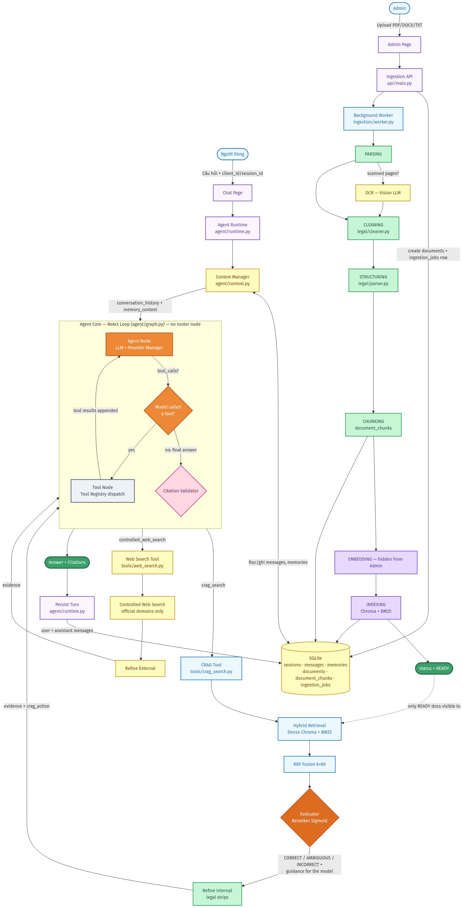

# Sơ đồ và Luồng Hoạt động Toàn diện — Legal CRAG Assistant

> **Tài liệu thuyết minh kiến trúc Agentic CRAG (Chat + Admin): vòng lặp tác tử ReAct tự quyết định gọi công cụ (Agent Core), Quản lý Bộ nhớ/Lịch sử/Phiên làm việc (Context Manager), và Pipeline Nạp Dữ liệu theo giai đoạn (Ingestion Pipeline).**

---

## MỤC LỤC

1. [Tổng quan Kiến trúc](#1-tổng-quan-kiến-trúc)
2. [Sơ đồ Luồng Hoạt động Toàn diện](#2-sơ-đồ-luồng-hoạt-động-toàn-diện)
3. [Agent Core: Vòng lặp ReAct — không có Router](#3-agent-core-vòng-lặp-react--không-có-router)
4. [Agent Runtime: Session, History, Memory](#4-agent-runtime-session-history-memory)
5. [Pipeline Nạp Dữ liệu (Ingestion Pipeline)](#5-pipeline-nạp-dữ-liệu-ingestion-pipeline)

---

## 1. Tổng quan Kiến trúc

Hệ thống tách bạch rõ hai luồng nghiệp vụ, chia sẻ một cơ sở dữ liệu SQLite duy nhất:

- **Chat (người dùng cuối):** `Chat Page` → `Agent Runtime` (`agent/runtime.py`) → `Context Manager` (`agent/context.py`) → **Agent Core** — một vòng lặp ReAct thật (`agent/graph.py`: node `agent` ⇄ node `tools`), không phải một đồ thị cố định với node "router" phân loại trước. Mô hình ngôn ngữ tự quyết định gọi tool nào (hoặc không gọi tool nào) dựa trên system prompt (`agent/prompts.py`) và schema 2 tool được bind vào lời gọi (`Tool Registry`, `tools/registry.py`).
- **Admin (quản trị kho tri thức):** `Admin Page` → `Ingestion API` (`api/main.py`) → `Background Worker` (`ingestion/worker.py`) → Pipeline theo giai đoạn (`ingestion/pipeline.py`) → Chroma + BM25.
- **Dữ liệu dùng chung (SQLite `app.db`):**
  - `documents`, `document_chunks`, `ingestion_jobs`, `legal_relations` — corpus & trạng thái nạp dữ liệu.
  - `clients`, `sessions`, `messages`, `memories` — phiên hội thoại, lịch sử, và hồ sơ ngữ nghĩa dài hạn.

---

## 2. Sơ đồ Luồng Hoạt động Toàn diện



Nguồn Mermaid: [`workflow.mmd`](workflow.mmd).

---

## 3. Agent Core: Vòng lặp ReAct — không có Router

**Không còn `SemanticRouter`/node `route_question` phân loại `database`/`rag`/`general` trước khi vào đồ thị.** Thay vào đó, `agent/graph.py` chỉ có 3 node:

```
START -> agent -> (có tool_calls? -> tools -> agent (lặp lại)
                    : không -> cite_validate -> END)
```

Mô phỏng đúng vòng lặp lõi của Hermes Agent (`CONTRIBUTING.md`):
> Call LLM (OpenAI-compatible API) → If tool_calls in response: execute each tool via registry dispatch → add tool results to conversation → loop back to LLM call.

### 3.1. Tool Registry — đúng 2 tool, không có Database Tool riêng
`tools/registry.py` chỉ đăng ký:
- **`crag_search`** (`tools/crag_search.py`) — Hybrid Retrieval (Dense Chroma + BM25) → RRF Fusion (k=60) → Rerank (cross-encoder sigmoid) → Evaluator quyết định `CORRECT`/`AMBIGUOUS`/`INCORRECT` → Refine Internal (legal strips). Trả về evidence kèm `guidance` — chuỗi hướng dẫn mô hình có nên gọi thêm `controlled_web_search` hay không. **Không có bước tra cứu SQL/database riêng** — không có khái niệm "user chat rồi tự động search database" trong kiến trúc này.
- **`controlled_web_search`** (`tools/web_search.py`) — tìm kiếm trên cổng thông tin pháp luật chính thống, tự soạn truy vấn (không có node rewrite riêng), refine kết quả thành legal strips trước khi trả về.

### 3.2. Agent Node (`agent/nodes.py::agent_node`)
Một lượt LLM: build system prompt (tool-use policy + quy tắc trích dẫn + `conversation_history` + `memory_context`) nếu là lượt đầu tiên của turn, gọi `llm.bind_tools([...])`. Nếu response có `tool_calls` → `Tool Node` thực thi qua `registry.execute()`, kết quả nối vào hội thoại dưới dạng `ToolMessage`, quay lại `agent`. Nếu không có `tool_calls` → nội dung được parse thành JSON `{"answer","claims","abstain"}` (một lần retry định dạng nếu parse thất bại) → `cite_validate`.

Số vòng lặp bị chặn bởi `MAX_TOOL_ROUNDS` (agent/nodes.py) để không lặp vô hạn nếu mô hình cứ liên tục gọi tool.

### 3.3. Không có Checkpointer
`build_crag_graph()` không nhận `checkpointer` — LangGraph chỉ điều phối **trong một lượt** (intra-turn); tính liên tục **giữa các lượt** hoàn toàn do Context Manager + SQLite đảm nhiệm (mục 4).

### 3.4. `route`/`crag_action` chỉ còn là nhãn quan sát (observability)
Sau khi turn kết thúc, `agent/nodes.py::derive_route_and_action()` suy ra `route` (`database` đã bị loại bỏ khỏi tập giá trị khả dĩ — chỉ còn `rag`/`general`) và `crag_action` từ `tool_trace` (danh sách tool nào đã thực sự được gọi) — **không còn là quyết định điều khiển luồng**, chỉ để ghi log/API/DB tương thích ngược.

---

## 4. Agent Runtime: Session, History, Memory

### 4.1. Agent Runtime (`agent/runtime.py`)
Điểm vào duy nhất cho một lượt hội thoại, dùng chung bởi CLI, eval harness, và cả 2 endpoint chat.
- `prepare_turn()`: phân giải `client_id`/`session_id`, trích xuất bộ nhớ ngữ nghĩa mới, gọi Context Manager để lắp ráp `AgentState` đầu vào.
- `persist_turn()`: ghi cặp message user/assistant vào bảng `messages` sau khi Agent Core sinh câu trả lời.

### 4.2. Context Manager (`agent/context.py`)
- **History (ngắn hạn):** đọc `HISTORY_TURNS` lượt gần nhất từ bảng `messages`, định dạng thành `conversation_history` — đưa thẳng vào system prompt của Agent Core để xử lý câu hỏi nối tiếp.
- **Memory (dài hạn):** đọc hồ sơ ngữ nghĩa từ bảng `memories`, quản trị chặt bằng `ALLOWED_MEMORY_KEYS` — không bao giờ dùng làm căn cứ pháp lý.

### 4.3. Session (bảng `sessions`)
Một phiên = một `client_id` + một `session_id`; tạo/touch (`last_active_at`) ở đầu mỗi lượt.

### 4.4. Provider Manager (`llm.py`)
`get_chat_model_with_fallback()`: thử `LLM_PROVIDER` cấu hình trước, nếu khởi tạo thất bại thì lần lượt thử các provider trong `LLM_FALLBACK_PROVIDERS`.

---

## 5. Pipeline Nạp Dữ liệu (Ingestion Pipeline)

1. `POST /api/admin/documents/upload` (một file) hoặc `POST /api/admin/documents/upload-batch` (nhiều file/cả thư mục — form field `files` lặp lại nhiều lần) lưu file, tạo bản ghi `documents` (status=`UPLOADED`) + `ingestion_jobs` (stage=`PARSING`) cho từng file, giao cho `ingestion/worker.py`, trả về ngay danh sách `{document_id, status, job_id}` (hoặc `BatchUploadResult` với từng file `QUEUED`/`SKIPPED`/`ERROR`).
2. `ingestion/worker.py`: thread pool nền (`INGESTION_WORKERS`, mặc định 3) chạy nhiều tài liệu song song — không chỉ một tài liệu một lúc. Upload theo lô (`submit_batch_ingestion`) cho mỗi tài liệu bỏ qua rebuild BM25 riêng (`rebuild_bm25=False`) và chỉ rebuild đúng một lần sau khi *toàn bộ* lô hoàn tất, tránh việc rebuild toàn bộ corpus (O(tổng số chunk)) lặp lại N lần cho N file.
3. `ingestion/pipeline.py::run_ingestion_pipeline()` chạy tuần tự cho từng tài liệu: `PARSING` → `OCR` (chỉ khi thực sự phát hiện trang scan; các trang OCR chạy song song qua `OCR_CONCURRENCY` — mặc định 4 — worker thread gọi Vision LLM, vì bottleneck thật của file nhiều trang là round-trip mạng của OCR, không phải việc render ảnh) → `CLEANING` (`legal/cleaner.py`: loại dot-leader/mục lục/số trang/khối "Nơi nhận", chuẩn hoá Unicode & khoảng trắng — không đụng tới `Điều/Khoản/Điểm`) → `STRUCTURING` (`legal/parser.py`, gắn `page_start`/`page_end`) → `CHUNKING` (ghi `document_chunks`) → `EMBEDDING` (theo batch 64 chunk) → `INDEXING` (BM25, ẩn khỏi Admin).
4. Mỗi giai đoạn cập nhật `ingestion_jobs.stage`/`progress` (coarse) **và** `detail`/`processed_units`/`total_units` (fine-grained, thay đổi liên tục trong một giai đoạn — ví dụ `"OCR trang 12/45"`, `"Đang nhúng đoạn 320/1200"`) để Admin UI hiển thị tiến trình thực đang chạy, không đứng yên ở một tên giai đoạn trong nhiều phút với file lớn. Mọi giai đoạn/bước con đều được ghi log kèm thời gian thực thi qua `logging_config.timed_stage` để chẩn đoán chính xác thời gian rơi vào đâu từ console.
5. Chỉ tài liệu có `documents.status = 'READY'` mới được `ingestion/indexer.py` đưa vào Chroma/BM25 — tức là chỉ tài liệu READY mới được `crag_search` nhìn thấy.
6. Lỗi ở bất kỳ giai đoạn nào → `documents.status = 'FAILED'` kèm `error_message`, dọn sạch mọi vector đã lỡ ghi.
7. Trùng nội dung (`content_hash` SHA-256): upload lại cùng file trả về `409` (hoặc `SKIPPED` trong lô) trừ khi gọi lại với `?replace=true`.

Schema liên quan (`schema.sql`): `documents`, `document_chunks`, `ingestion_jobs` (nay có thêm `detail`, `processed_units`, `total_units`), `legal_relations`.
