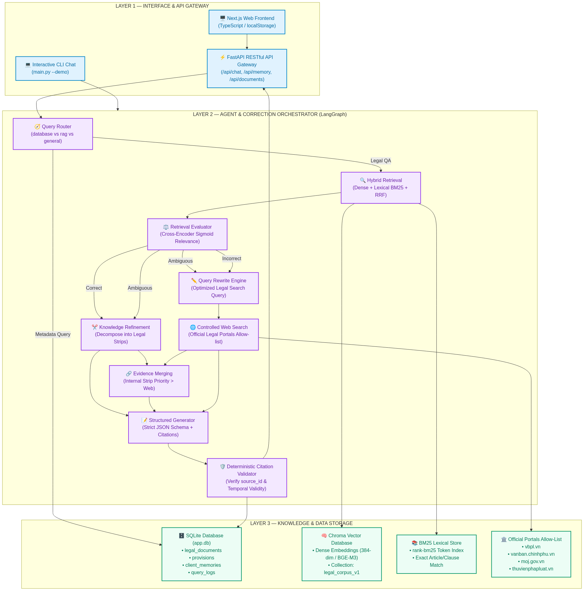
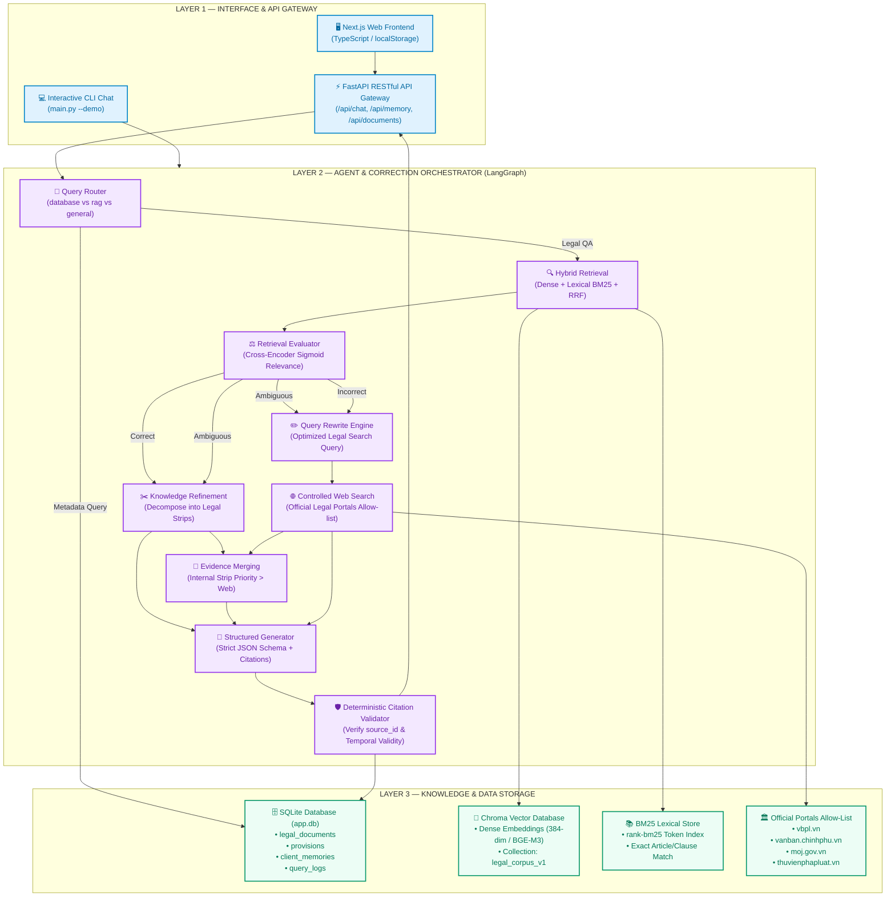
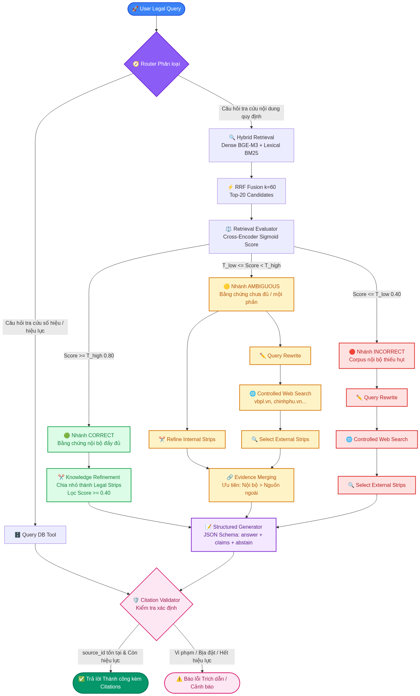
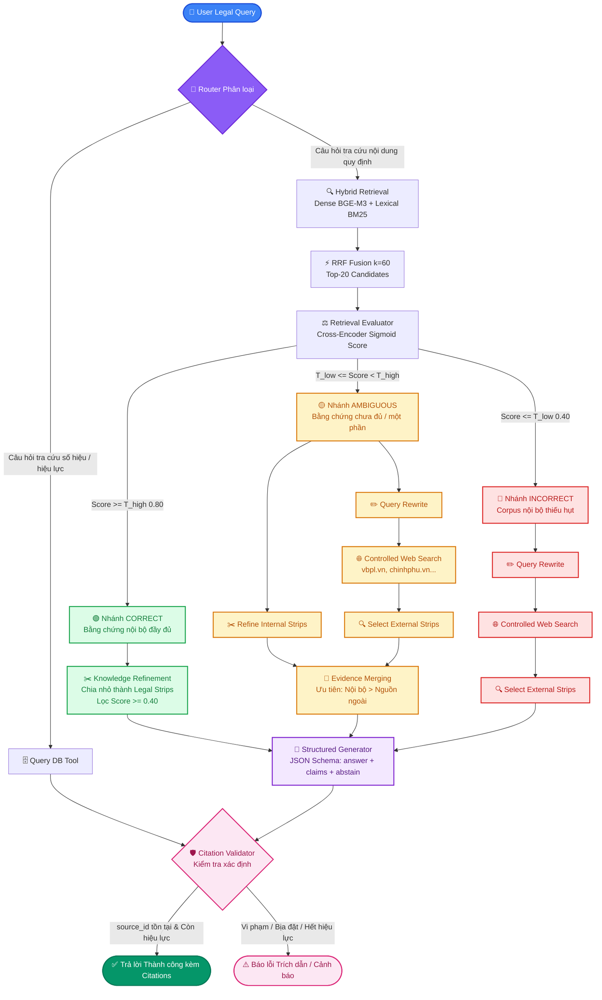
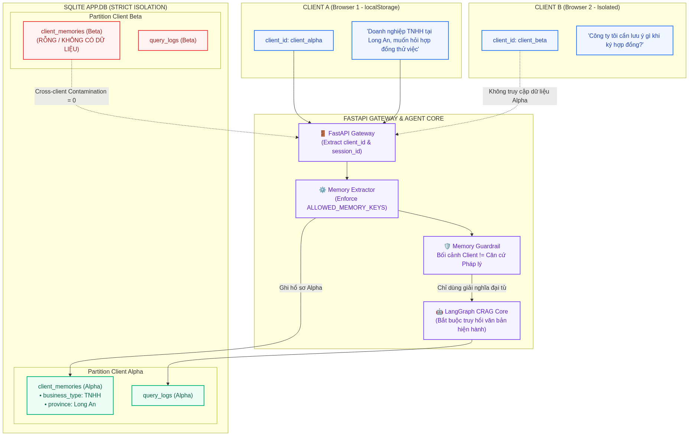
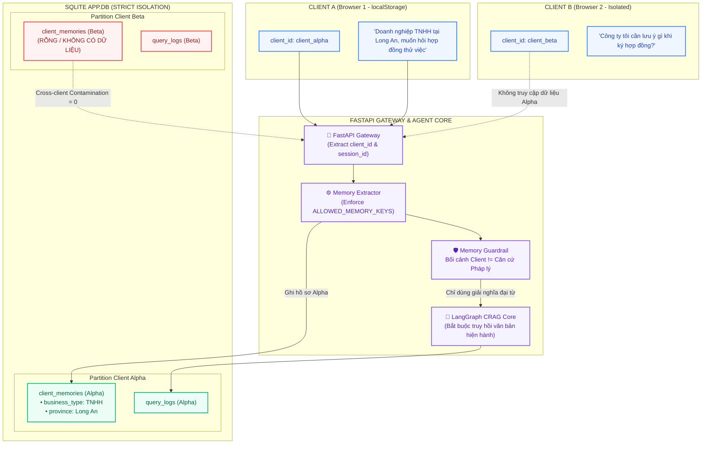

# Tài liệu Luồng Hoạt động Hệ thống (Workflow Architecture)

> **Mô tả chi tiết nguyên lý vận hành, kiến trúc 3 tầng, quy trình tự hiệu chỉnh truy hồi Corrective RAG (CRAG) 3 nhánh và cơ chế quản lý Session Memory có kiểm soát.**

---

## MỤC LỤC

1. [Tổng quan Kiến trúc 3 Layer](#1-tổng-quan-kiến-trúc-3-layer)
2. [Sơ đồ Kiến trúc 3 Layer (Diagram 1)](#2-sơ-đồ-kiến-trúc-3-layer-diagram-1)
3. [Luồng Hoạt động Cốt lõi CRAG 3 Nhánh (Diagram 2)](#3-luồng-hoạt-động-cốt-lõi-crag-3-nhánh-diagram-2)
4. [Phân tích Chi tiết Từng Node Xử lý](#4-phân-tích-chi-tiết-từng-node-xử-lý)
5. [Cơ chế Session Memory & Cách ly Tuyệt đối (Diagram 3)](#5-cơ-chế-session-memory--cách-ly-tuyệt-đối-diagram-3)
6. [Tái lập Hình ảnh Sơ đồ từ Mermaid](#6-tái-lập-hình-ảnh-sơ-đồ-từ-mermaid)

---

## 1. Tổng quan Kiến trúc 3 Layer

Hệ thống Legal CRAG Assistant V3 tuân thủ nghiêm ngặt nguyên lý phân định ranh giới trách nhiệm (*Separation of Concerns*) giữa 3 tầng chức năng:

- **Layer 1 — Interface & API:**  
  Tiếp nhận yêu cầu từ người dùng qua CLI hoặc FastAPI Gateway. Phụ trách quản lý định danh ẩn danh (`client_id`, `session_id`) và trả về kết quả kèm bảng trích dẫn minh bạch.
- **Layer 2 — Agent & Correction (LangGraph):**  
  Bộ não điều phối luồng thực thi: Phân luồng câu hỏi, truy hồi lai, chấm điểm bằng chứng bằng mô hình độc lập (*Retrieval Evaluator*), rẽ 3 nhánh xử lý thích ứng (*Knowledge Refinement, Query Rewrite, Controlled Web Search, Evidence Merging*), sinh câu trả lời có cấu trúc và kiểm định trích dẫn xác định (*Citation Validator*).
- **Layer 3 — Knowledge & Data:**  
  Hạ tầng dữ liệu bền vững gồm SQLite (`app.db`) quản lý văn bản, điều khoản và lịch sử; ChromaDB lưu trữ Dense Vector Index; rank-bm25 lưu trữ Lexical Index; và bộ lọc tên miền công quyền chính thống (`vbpl.vn`, `chinhphu.vn`...).

---

## 2. Sơ đồ Kiến trúc 3 Layer (Diagram 1)





---

## 3. Luồng Hoạt động Cốt lõi CRAG 3 Nhánh (Diagram 2)

Trọng tâm của kỹ thuật Corrective RAG là **không bao giờ tin tưởng tuyệt đối vào kết quả truy hồi ban đầu**. Thay vào đó, bộ đánh giá độc lập phân loại tập ứng viên thành 3 trạng thái điều kiện:

- 🟢 **CORRECT ($Score \ge T_{high} = 0.80$):** Bằng chứng nội bộ đầy đủ $\to$ Kích hoạt *Knowledge Refinement* bóc tách các legal strips cụ thể $\to$ Đưa vào Generator.
- 🟡 **AMBIGUOUS ($T_{low} \le Score < T_{high}$):** Bằng chứng nội bộ có một phần $\to$ Vừa tinh lọc nội bộ, vừa viết lại truy vấn để tìm kiếm bổ sung trên web $\to$ *Evidence Merging* hợp nhất đa nguồn có ưu tiên.
- 🔴 **INCORRECT ($Score \le T_{low} = 0.40$):** Bằng chứng nội bộ thiếu hụt $\to$ Loại bỏ tài liệu rác $\to$ Viết lại truy vấn $\to$ Gọi Controlled Web Search cổng thông tin nhà nước.





---

## 4. Phân tích Chi tiết Từng Node Xử lý

| Tên Node | Module thực thi | Chức năng chi tiết và Quy tắc vận hành |
|---|---|---|
| `router` | `agent/nodes.py` | Kiểm tra regex số hiệu văn bản và từ khóa hiệu lực. Nếu tra cứu hiệu lực/ngày ban hành $\to$ chuyển `db`; nếu chào hỏi ngắn $\to$ `general`; còn lại $\to$ `rag`. |
| `query_db` | `tools/database.py` | Truy vấn trực tiếp các bảng quan hệ SQLite (`legal_documents`, `legal_relations`) để lấy tình trạng hiệu lực và văn bản sửa đổi/bổ sung/thay thế. |
| `hybrid_retrieve` | `retrieval/` | Chạy đồng thời `dense_retrieve` (Chroma vector) và `bm25_retrieve` (rank-bm25), sau đó kết hợp bằng giải thuật Reciprocal Rank Fusion ($k=60$) tạo danh sách Top-20. |
| `evaluate_retrieval` | `retrieval/reranker.py` | Sử dụng Cross-Encoder tính relevance score chuẩn hóa hàm Sigmoid vào $[0, 1]$. So sánh điểm tối đa với hai ngưỡng $(T_{low}=0.40, T_{high}=0.80)$ để rẽ 3 nhánh. |
| `refine_internal_node` | `retrieval/refine.py` | Bóc tách từng Điều/Khoản thành các *Legal Strips* độc lập, chấm lại điểm liên quan và chỉ giữ lại các strip có điểm $\ge \text{INTERNAL\_STRIP\_MIN} = 0.40$. |
| `rewrite_query_node` | `agent/nodes.py` | Loại bỏ từ ngữ thừa trong câu hỏi tự nhiên (như *"cho tôi hỏi"*, *"theo quy định hiện hành thì"*...), chuẩn hóa thành từ khóa chuyên ngành để tìm kiếm web chính xác. |
| `web_search_node` | `tools/web_search.py` | Thực thi tìm kiếm trên DuckDuckGo với bộ lọc tên miền công quyền cho phép (`vbpl.vn`, `vanban.chinhphu.vn`, `moj.gov.vn`, `chinhphu.vn`, `thuvienphapluat.vn`). |
| `select_external_node` | `retrieval/refine.py` | Tải trang hoặc trích xuất snippet từ web, phân tách thành các legal strips và chấm điểm chọn lọc các strip đạt chuẩn. |
| `merge_evidence_node` | `retrieval/refine.py` | Hợp nhất danh sách bằng chứng nội bộ và ngoài web, khử trùng lặp theo locator, áp dụng độ ưu tiên: **Nội bộ chính thống (priority=2) > Nguồn bổ trợ ngoài (priority=1)**. |
| `generate_answer` | `agent/nodes.py` | Sử dụng prompt ràng buộc nghiêm ngặt (Listing 3.14), ép định dạng JSON Schema gồm `answer`, `claims` có gắn kèm `source_ids`, và cờ `abstain` khi không đủ căn cứ. |
| `validate_citations_node`| `legal/citations.py` | Đối chiếu từng `source_id` được trích dẫn với tập bằng chứng thực tế; kiểm tra văn bản có còn hiệu lực tại ngày tham chiếu `as_of_date` hay không. |

---

## 5. Cơ chế Session Memory & Cách ly Tuyệt đối (Diagram 3)

### 3 Cấp độ Memory:
1. **Tier 1 — Working Memory (`AgentState`):** Duy trì trong RAM suốt 1 turn truy vấn.
2. **Tier 2 — Episodic Memory (`query_logs` SQLite):** Lưu vết tuần tự mọi câu hỏi, câu trả lời, route và action đã chọn.
3. **Tier 3 — Semantic Profile (`client_memories` SQLite):** Ghi nhớ thuộc tính bền vững của doanh nghiệp chỉ qua 5 thuộc tính được phép trong `ALLOWED_MEMORY_KEYS`:
   - `business_type`: Loại hình (TNHH, Cổ phần...)
   - `industry`: Ngành nghề (Xây dựng, Bán lẻ...)
   - `province`: Địa bàn (Hà Nội, TP.HCM, Long An...)
   - `frequent_topic`: Lĩnh vực hay hỏi (Lao động, Hợp đồng...)
   - `preferred_answer`: Phong cách mong muốn (Ngắn gọn, Chi tiết...)





---

## 6. Tái lập Hình ảnh Sơ đồ từ Mermaid

Hệ thống đã xây dựng sẵn công cụ `scripts/render_mermaid.py` để tự động render toàn bộ sơ đồ Mermaid trong tài liệu này thành các file ảnh PNG và SVG chất lượng cao:

```bash
# Render toàn bộ sơ đồ trong WORKFLOW.md sang thư mục docs/images/
python scripts/render_mermaid.py docs/WORKFLOW.md --output-dir docs/images
```

Các file ảnh kết quả sẽ được tạo tại:
- `docs/images/arch_3layer.png` & `arch_3layer.svg`
- `docs/images/crag_workflow.png` & `crag_workflow.svg`
- `docs/images/memory_isolation.png` & `memory_isolation.svg`
